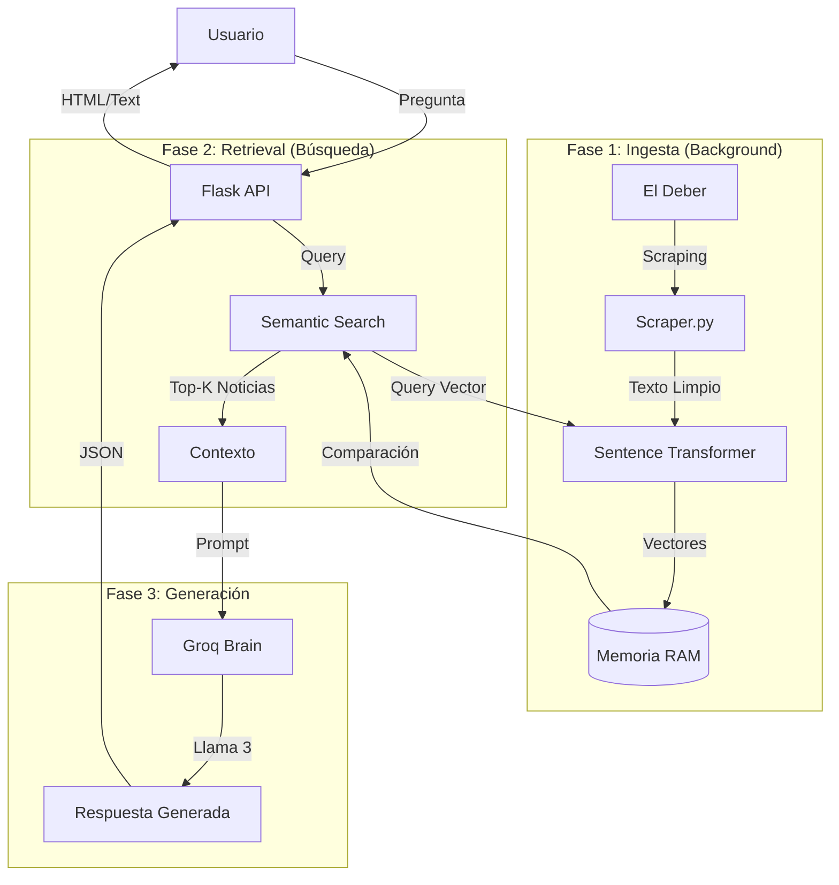

# 📘 Ficha Técnica Maestra: El Deber Bot

> **Versión del Documento**: 1.0
> **Fecha de Generación**: Noviembre 2024
> **Propósito**: Documentación técnica exhaustiva para desarrolladores y mantenedores.

---

## 1. 🌟 Visión General del Proyecto
**El Deber Bot** es un sistema de Inteligencia Artificial conversacional diseñado para democratizar el acceso a la información periodística de Bolivia. Funciona como un asistente virtual que "lee" en tiempo real las noticias del diario *El Deber* y responde preguntas de los usuarios basándose estrictamente en esa información.

El sistema implementa una arquitectura **RAG (Retrieval-Augmented Generation)**, combinando la precisión de búsqueda de información actualizada con la capacidad de síntesis y lenguaje natural de los Modelos de Lenguaje Grande (LLMs).

### Capacidades Principales
*   **Scraping en Tiempo Real**: Monitoreo activo de múltiples secciones de noticias.
*   **Búsqueda Semántica**: Entendimiento del significado de las preguntas, no solo palabras clave.
*   **Síntesis Inteligente**: Generación de respuestas coherentes citando fuentes.
*   **Interfaz Reactiva**: UI moderna con feedback visual de procesos en segundo plano.

---

## 2. 🛠️ Stack Tecnológico

### Backend & Core
| Tecnología | Versión | Propósito |
| :--- | :--- | :--- |
| **Python** | 3.10+ | Lenguaje base del servidor y lógica de IA. |
| **Flask** | 3.0.0 | Micro-framework web para servir la API y el Frontend. |
| **Werkzeug** | 3.0.1 | Utilidades WSGI subyacentes a Flask. |

### Inteligencia Artificial (AI/ML)
| Librería/Servicio | Modelo/Versión | Función |
| :--- | :--- | :--- |
| **Groq API** | `llama-3.1-8b-instant` | **Cerebro Generativo**. Procesa el contexto y genera la respuesta final a velocidad extrema. |
| **Sentence-Transformers** | `paraphrase-multilingual-MiniLM-L12-v2` | **Motor de Embeddings**. Convierte texto a vectores (384 dimensiones) para búsqueda semántica. |
| **Scikit-learn** | 1.3.2 | Cálculo de **Similitud Coseno** para ranking de relevancia. |
| **Numpy** | 1.24.3 | Operaciones matemáticas vectoriales de alto rendimiento. |
| **PyTorch** | 2.1.0 | Backend de cómputo para los transformers. |

### Web Scraping & Datos
| Herramienta | Propósito |
| :--- | :--- |
| **Requests** | Cliente HTTP con estrategia de reintentos (Retry Strategy) para robustez ante fallos de red. |
| **BeautifulSoup4** | Parser HTML (con `lxml`) para extracción precisa de contenido del DOM. |
| **ThreadPoolExecutor** | Concurrencia para procesar múltiples páginas de noticias simultáneamente. |

### Frontend
*   **HTML5 / CSS3**: Diseño moderno con variables CSS, Glassmorphism y animaciones.
*   **Vanilla JavaScript**: Lógica de cliente ligera (Fetch API, DOM manipulation) sin frameworks pesados.
*   **Jinja2**: Motor de plantillas (usado mínimamente para inyección inicial de estado).

---

## 3. 🏗️ Arquitectura del Sistema

El sistema sigue un patrón modular donde cada componente tiene una responsabilidad única.

### Diagrama de Flujo de Datos


---

## 4. 📂 Estructura de Archivos y Componentes

### `app.py` (Controlador Principal)
Es el punto de entrada. Configura el servidor Flask y define las rutas.
*   **Rutas Clave**:
    *   `GET /`: Sirve la interfaz de usuario.
    *   `POST /api/chat`: Endpoint principal de consulta. Recibe JSON `{'question': '...'}`.
    *   `GET /api/status`: Long-polling para barra de progreso y estado del bot.
    *   `POST /api/toggle-groq`: Switch para activar/desactivar el uso de LLM externo.

### `chatbot.py` (Orquestador)
Clase `NewsChatBot`. Actúa como fachada (Facade Pattern) que coordina los subsistemas.
*   **Responsabilidad**: Inicialización asíncrona (threading) para no bloquear el arranque del servidor.
*   **Método `answer()`**: Coordina la búsqueda + generación. Maneja casos de error y fallbacks.

### `brain.py` (Lógica de IA)
Contiene dos clases críticas:
1.  **`SemanticSearch` (Singleton)**:
    *   Carga el modelo `MiniLM-L12`.
    *   **Indexación**: `index_documents()` convierte noticias a vectores.
    *   **Búsqueda Híbrida**: Implementa un algoritmo propio que combina similitud semántica pura con *Keyword Boosting* (bonificación de puntaje si palabras clave exactas aparecen en el texto).
2.  **`GroqBrain`**:
    *   Wrapper para la API de Groq.
    *   Construye el *System Prompt* que instruye al modelo a ser un "asistente de noticias bolivianas" y a no alucinar información.

### `scraper.py` (Motor de Extracción)
Sistema robusto de extracción de datos.
*   **Sesión Persistente**: Usa `requests.Session()` con adaptadores HTTP para reutilizar conexiones TCP.
*   **Estrategia de Reintentos**: Configurado para reintentar automáticamente en errores 5xx o 429 (Rate Limits).
*   **Paralelismo**: Usa `ThreadPoolExecutor` para descargar múltiples páginas de noticias a la vez, reduciendo el tiempo de carga.
*   **Selectores Inteligentes**: Lista de selectores CSS de respaldo (`fallback`) por si el diseño de la web cambia.

### `templates.py` (Frontend)
Contiene la variable `HTML_TEMPLATE` que es una *Single File Component* gigante.
*   Incluye todo el HTML, CSS (estilos glassmorphism, animaciones de carga) y JavaScript del cliente.
*   Maneja la lógica de UI: Chat, barra de progreso, toggle de Groq, sugerencias.

### `config.py` (Configuración)
Centraliza constantes y variables de entorno.
*   `SECCIONES_CONFIG`: Diccionario que define qué URLs rastrear y cuántas páginas de profundidad.
*   `DATA_STORE`: Almacén en memoria (diccionario global) compartido entre hilos para guardar las noticias y el estado.

---

## 5. 🔄 Workflow Detallado

### A. Inicialización (Boot Sequence)
1.  Al ejecutar `python app.py`, Flask arranca inmediatamente.
2.  Se llama a `bot.initialize_async()`, que lanza un hilo demonio (daemon thread).
3.  **En el hilo secundario**:
    *   Se limpian las variables globales.
    *   Se ejecuta el scraping masivo.
    *   Se carga el modelo de embeddings en memoria (pesado).
    *   Se generan los vectores de todas las noticias descargadas.
    *   Se marca `initialized = True`.

### B. Ciclo de Vida de una Pregunta (Request Lifecycle)
1.  **Recepción**: Usuario envía "¿Qué pasó con el censo?".
2.  **Validación**: Se verifica que el bot esté inicializado y la pregunta no esté vacía.
3.  **Embedding**: La pregunta se vectoriza usando `SentenceTransformer`.
4.  **Retrieval (Recuperación)**:
    *   Se calcula la distancia coseno contra todos los vectores de noticias.
    *   Se aplica *Keyword Boosting* si "censo" aparece explícitamente.
    *   Se filtran resultados con score < 0.12 (umbral de relevancia).
    *   Se toman los Top-3 resultados.
5.  **Generation (Generación)**:
    *   Si Groq está activo: Se envía el texto de las Top-3 noticias + la pregunta al LLM.
    *   Si Groq está inactivo: Se formatea una respuesta estática con los resúmenes.
6.  **Respuesta**: Se devuelve un JSON con el texto final (Markdown) y metadatos.

---

## 6. ⚙️ Configuración y Variables de Entorno

El sistema requiere un archivo `.env` en la raíz:

```env
GROQ_API_KEY=gsk_...  # Tu API Key de Groq Cloud
```

### Parámetros Ajustables (`config.py`)
*   `SECCIONES_CONFIG`: Aumentar el número de páginas aumenta la base de conocimiento pero retarda el inicio.
*   `EMBEDDING_MODEL`: Por defecto `paraphrase-multilingual-MiniLM-L12-v2`. Es el mejor balance velocidad/precisión para español.

---

## 7. 🚨 Manejo de Errores y Limitaciones

*   **Fallos de Red**: El scraper reintenta 3 veces con *exponential backoff*. Si falla definitivamente, esa noticia se omite.
*   **Alucinaciones**: El prompt del sistema incluye instrucciones estrictas ("NO inventes datos") para minimizar invenciones, pero como todo LLM, no es infalible.
*   **Memoria**: Al ser una base de datos vectorial en memoria (RAM), el consumo crece linealmente con el número de noticias. Para producción masiva se requeriría una base de datos vectorial real (ej: Pinecone, ChromaDB).
